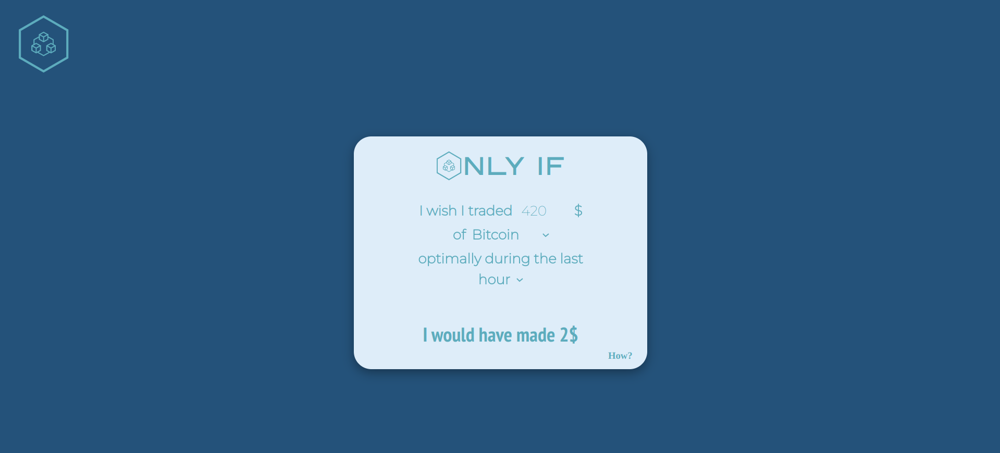

# ONLY IF

[Only if](https://only-if.netlify.app/) is a React app that finds you the most profitable position to own during a set time interval in the past for a chosen cryptocurrency. It takes the amount you wanted to trade (in USD), the cryptocurrency, and the time interval (last hour/day/week).

Supported cryptocurrencies: Bitcoin, Ethereum, BNB, XRP, Cardano, Solana, Dogecoin, Polkadot, Polygon, and Shiba Inu.




Contributions of any kind are welcome and appreciated. Don't forget to star the repository if you liked the project.

# Algorithm explanation

It uses Binance API to get the klines during the chosen time interval. It calculates the most profitable position by iterating through data points and for each data point, it checks whether the difference the current price and the minimum price before it (or the maximum for short positions) is greater than the best position found so far. As it iterates, it keeps updating the best position until it finds the global best. See the code in [calculatePosition.js](src/utils/calculatePosition.js).

# Development 

Clone and install.
```bash
git clone https://github.com/ali-salloum6/only-if.git
cd only-if
yarn add
```
##  Testing

Run unit tests
```bash
yarn test
```
  
##  License

This project is open source and available under the MIT License